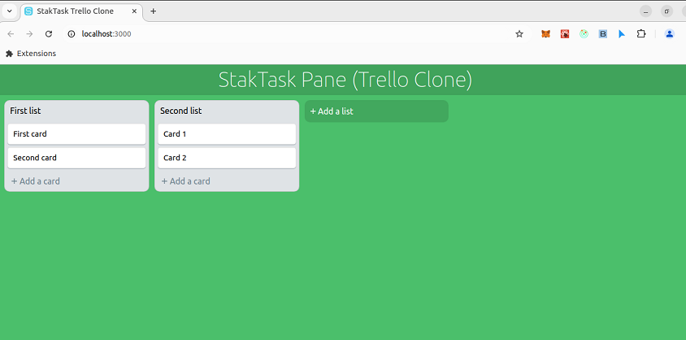

# staktask-trello-clone-dnd

> `StakTask DnD` part what I've taken part in at **StakOne AU** - Trello Clone

## getting started

```yaml
node.js: 14.21.3
```

```bash
$ npm install
$ npm start
```

Visit http://localhost:3000/



## modules

- [redux](https://redux.js.org): to manage the global state of the app
- [react-textarea-autosize](https://github.com/andreypopp/react-textarea-autosize): a react component that will render a textarea that resizes itself when needed
- [react-beautiful-dnd](https://github.com/atlassian/react-beautiful-dnd): A beautiful library to implement drag and drop functionalities
- [lodash.throttle](https://www.npmjs.com/package/lodash.throttle): to prevent too many calls of a function
- [shortid](https://github.com/dylang/shortid): to generate unique ids.

---

&copy; 2017 - 2024 @devmaster518

All rights reserved.
